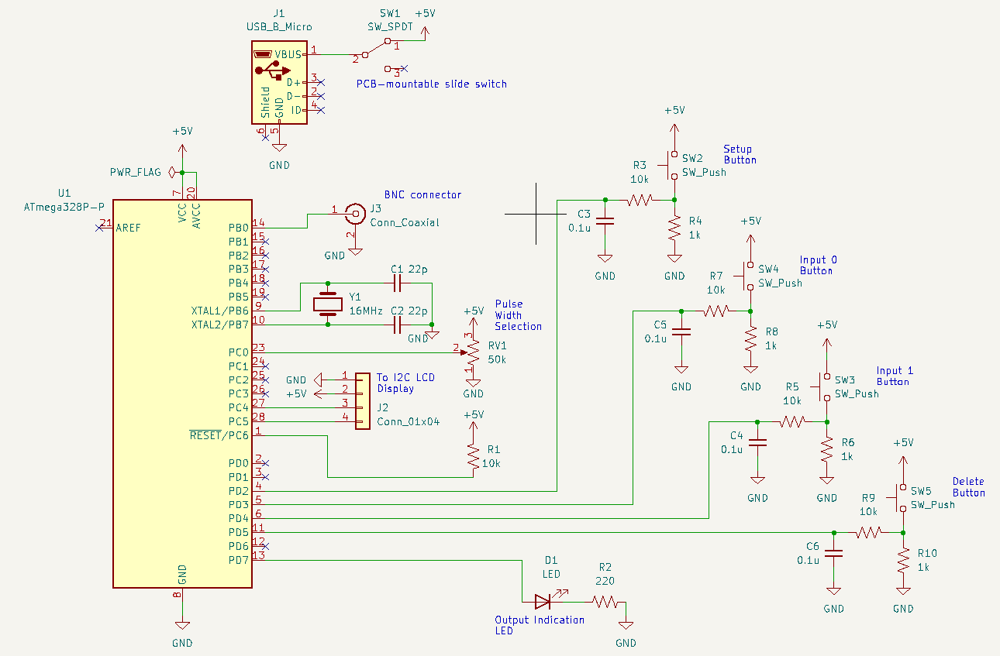
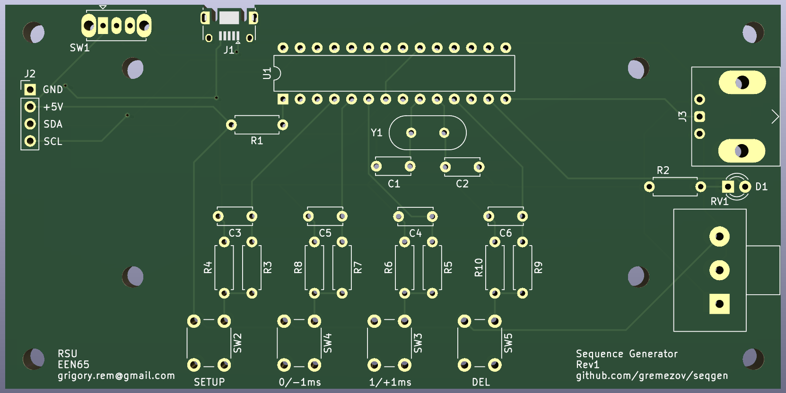
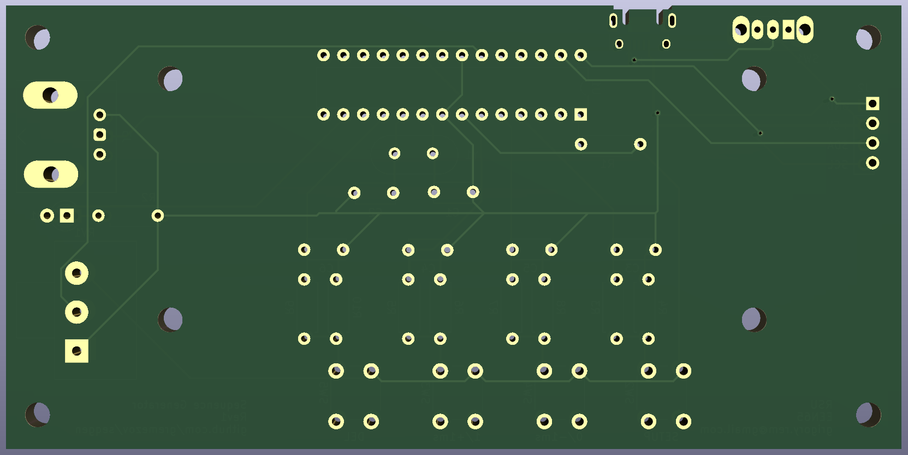

# seqgen
ATmega328P-based Sequence Generator. This device works by generating user-inputted sequences of digital pulses. It was created
for usage in the Telecom Laboratory at Rangsit University.

This repository contains both the firmware (Arduino code) as well as the KiCad files for the schematic as well as the PCB.

## Schematic

## PCB
**Top View:**

**Bottom View:**

